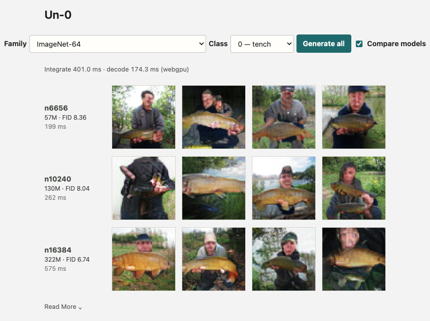

# Un-0-js

This repo ports [Un-0](https://github.com/unconv-ai/Un-0), an image generation model using coupled Kuramoto
oscillators, to JavaScript so it can be run in the browser.



Running live at https://tran-david.com/un-0-demo.

## Run locally

Requires [Node.js](https://nodejs.org/) 20.19+.

```bash
npm install
npm run dev
```

Open http://localhost:5173.

A WebGPU-capable browser (Chrome, Edge, recent Safari) is recommended.

## Models

All six released Un-0 checkpoints are included:

| Checkpoint | Dataset | Params | Download | FID |
| --- | --- | --- | --- | --- |
| `cifar10/n1024` | CIFAR-10 32×32 | 1.3M | 5 MB | 11.16 |
| `cifar10/n2048` | CIFAR-10 32×32 | 4.9M | 20 MB | 9.38 |
| `cifar10/n4096` | CIFAR-10 32×32 | 19.4M | 78 MB | 8.86 |
| `imagenet64/n6656` | ImageNet 64×64 | 57M | 114 MB | 8.36 |
| `imagenet64/n10240` | ImageNet 64×64 | 130M | 260 MB | 8.04 |
| `imagenet64/n16384` | ImageNet 64×64 | 322M | 645 MB | 6.74 |

FID values are clean-FID for CIFAR-10 and ADM FID for ImageNet-64 (comparable
within a family, not across). Lower score is better.

Checkpoints live in `public/un0/`, split into 20 MB parts to stay under
static-hosting file limits. The full clone is about 1 GB.

## How it works

`src/un0.ts` mirrors the reference model in eval mode: conditional Kuramoto
dynamics (with a one-way class-conditioned drive) integrated by fixed-step Euler,
then relativization (`mean_relative` or `ref_oscillator`, per checkpoint) with a
sin/cos readout, then a resize-conv decoder to RGB. The Euler step and the decoder
are `jit`-compiled with jax-js. `src/Un0DemoPage.tsx` is the UI: model/class
pickers, download progress with cancel, a compare mode that runs every model in a
family on the same seed, and capability checks that gate or warn about models the
current device can't run well.

## Links

- [Un-0](https://github.com/unconv-ai/Un-0): the original model and training code
- [Un-0 weights on Hugging Face](https://huggingface.co/un-ai/Un-0)
- [jax-js](https://github.com/ekzhang/jax-js): JAX for the browser
- [Introducing Un-0](https://unconv.ai/blog/introducing-un-0-generating-images-with-coupled-oscillators/): the announcement blog post

## License

[MIT](LICENSE). The bundled checkpoints are from
[un-ai/Un-0](https://huggingface.co/un-ai/Un-0), also MIT.
